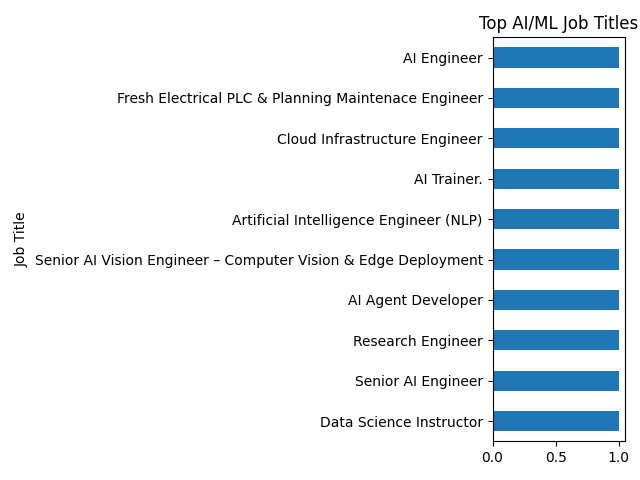
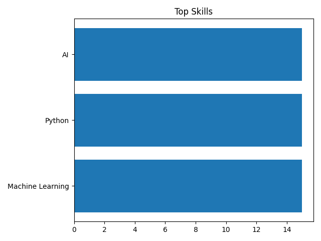
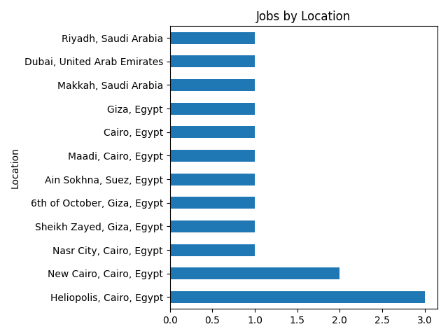

# Top AI/ML Jobs in MENA – May 2025

## Top 10 Job Titles
- Data Science Instructor (1)
- Senior AI Engineer (1)
- Research Engineer (1)
- AI Agent Developer (1)
- Senior AI Vision Engineer – Computer Vision & Edge Deployment (1)
- Artificial Intelligence Engineer (NLP) (1)
- AI Trainer. (1)
- Cloud Infrastructure Engineer (1)
- Fresh Electrical PLC & Planning Maintenace Engineer (1)
- AI Engineer (1)

## Most Required Skills
- Machine Learning (15)
- Python (15)
- AI (15)

## Job Distribution by Location
- Heliopolis, Cairo, Egypt (3)
- New Cairo, Cairo, Egypt (2)
- Nasr City, Cairo, Egypt (1)
- Sheikh Zayed, Giza, Egypt (1)
- 6th of October, Giza, Egypt (1)
- Ain Sokhna, Suez, Egypt (1)
- Maadi, Cairo, Egypt (1)
- Cairo, Egypt (1)
- Giza, Egypt (1)
- Makkah, Saudi Arabia (1)
- Dubai, United Arab Emirates (1)
- Riyadh, Saudi Arabia (1)

## Visualizations

